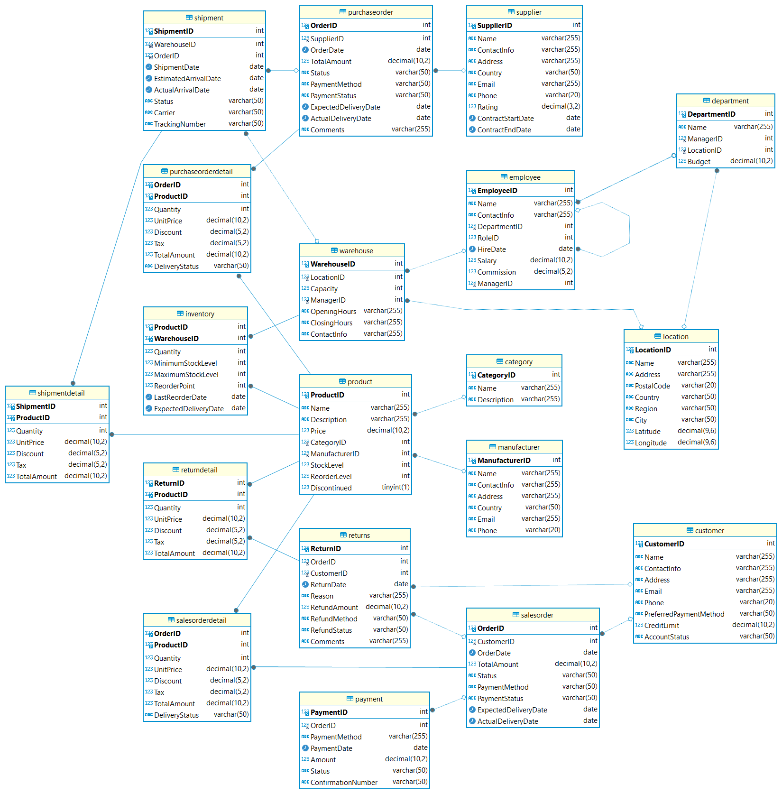
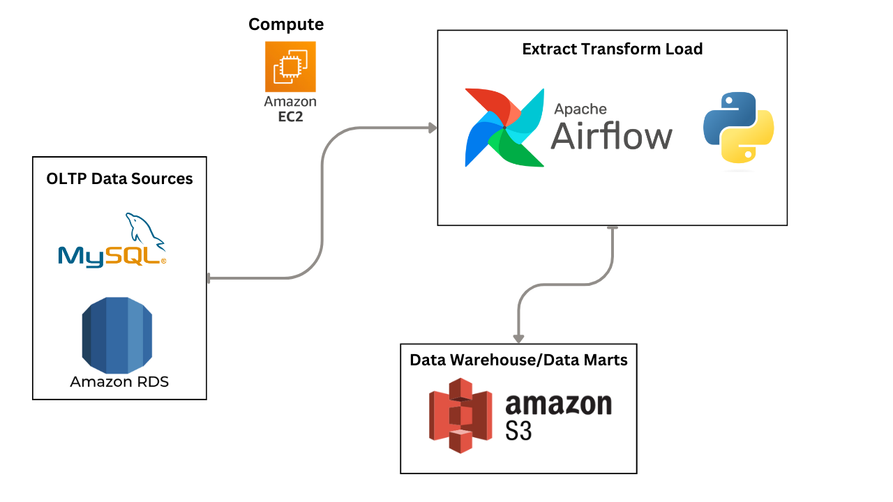

# ETL Pipeline of Cola Next Pvt. Ltd. using Apache Airflow

## Overview
Data warehouses are hallmarks of industrial data analytics initiatives. Trends of developing analytical pipelines without data warehouses may be non-sustainable and non-scalable. At the same time, structuring a structured warehouse or data mart from a non-clean, haphazard, highly normalized, and ad-hoc OLTP “spaghetti” is a big challenge. In this challenge, you will be required to structure a data warehouse (henceforth data mart) from a given OLTP spaghetti and transfer data from OLTP to the data mart. The requirement is to implement the mart as a star schema through dimensional modelling. 

## Problem Statement
Next Cola, a beverages company, struggles to maintain optimal inventory levels across its expanding network of warehouses. Inefficient stock management leads to frequent stockouts, overstocking, and lost revenue. Next Cola aims to implement a data warehouse solution specifically tailored for inventory analysis to empower data-driven decision-making.

## ETL Data Pipeline
An ETL pipeline is a process that involves three main steps: Extract, Transform, and Load. First, data is extracted from various sources such as databases, websites, or files. Next, this data is transformed, meaning it is cleaned, filtered, and organized into a usable format. Finally, the transformed data is loaded into a new system like a database or data warehouse, where it can be analyzed and used for making decisions. Essentially, an ETL pipeline collects raw data, refines it, and delivers it in a ready-to-use form for analysis and reporting.

## Tech Stack:
- *Python*
- *MySQL*
- *Amazon RDS*
- *AWS S3*
- *Apache Airflow*

## Business ERD:

## Steps Performed:
- Engineered an ETL pipeline using Python and Apache Airflow, seamlessly extracting data from MySQL database
- Utilized star schema for data marts derived from OLTP sources, enhancing data organization and accessibility.
- Loaded data onto AWS S3 Bucket for scalable storage, ensuring high availability and durability of data assets.

## Data Flow Architecture diagram

